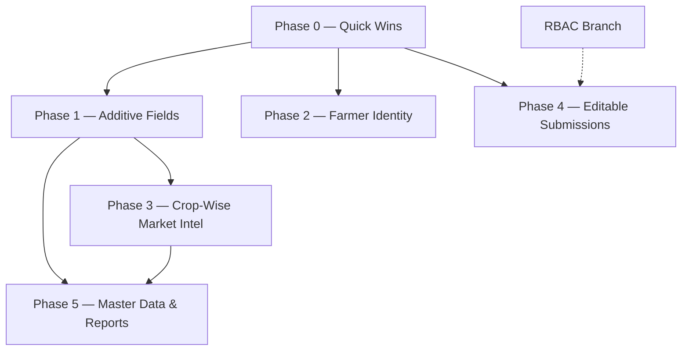

# FPS Enhancement Phases — Master Index

> **Source of record:** [requirements-specification.md](../requirements-specification.md) (canonical *what*).
> This folder defines *how* and *when* — one standalone phase doc per module.

---

## Phase Overview

| # | Phase | Scope | Effort | Dependencies |
|---|-------|-------|--------|--------------|
| 0 | [Quick Wins](PHASE-0-Quick-Wins.md) | Low-risk, cross-cutting changes that ship immediately | S–M | None |
| 1 | [Additive Fields](PHASE-1-Additive-Fields.md) | New fields & minor model additions (Market Intelligence + Product Performance) | M | Phase 0 |
| 2 | [Farmer Identity & Profiling](PHASE-2-Farmer-Identity-Profiling.md) | Phone-based unique farmer, auto-fill, visit grouping | L | Phase 0 |
| 3 | [Crop-Wise Market Intelligence](PHASE-3-CropWise-Market-Intelligence.md) | Restructure Market Intelligence for per-crop arrivals & review | L | Phase 1 |
| 4 | [Editable Submissions & Audit](PHASE-4-Editable-Submissions-Audit.md) | Time-boxed post-submission edits, version history, audit trail | L | Phase 0, RBAC branch |
| 5 | [Master Data Admin & Reports](PHASE-5-Master-Data-Reports.md) | Admin-managed master data + expanded reports/analytics dashboard | L | Phase 1, Phase 3 |

---

## Dependency Graph

---

## Requirements → Phase Traceability Matrix

Every requirement from the specification is mapped to exactly one phase. No requirement is duplicated or orphaned.

### Global Platform Requirements

| # | Requirement | Priority | Phase |
|---|-------------|----------|-------|
| G-1 | Future Date Selection Support | Now | **Phase 0** |
| G-2 | Home Dashboard Activity Feed (Recent Visits → Recent Activities) | Now | **Phase 0** |
| G-3 | One Phone Number = One Farmer | Later | **Phase 2** |
| G-4 | Edit Submitted Entries | Now | **Phase 4** |
| G-5 | CSV Export for Multiple Varieties | Done (Product Demo) | **Phase 1** (mandi crops in Phase 3) |
| G-6 | Module Naming Standardization | Remaining in Mobile | **Phase 0** |
| G-7 | Share Review Details | Now | **Phase 0** |

### Crop Intelligence Module

| # | Requirement | Priority | Phase |
|---|-------------|----------|-------|
| C-1 | Farmer Profiling & Auto-Fill | Later | **Phase 2** |
| C-2 | Farmer Visit Grouping | Later | **Phase 2** |
| C-3 | Admin Managed Master Data | Later | **Phase 5** |
| C-4 | Future Date Handling (CMM-specific) | Now | **Phase 0** (part of G-1) |

### Market Intelligence Module

| # | Requirement | Priority | Phase |
|---|-------------|----------|-------|
| M-1 | Market Trend field (UP/DOWN/STEADY) | Now | **Phase 1** |
| M-2 | Crop-Wise Arrival Entry | Now | **Phase 3** |
| M-3 | Filter Crops (Step 1 → Step 2 linkage) | Now | **Phase 3** |
| M-4 | Add "Self" Source | Now | **Phase 1** |
| M-5 | Market Insight Field | Now | **Phase 1** |
| M-6 | Merge Steps 4 & 5 (Photos + Location) | Now | **Phase 0** |
| M-7 | Crop-Wise Review Summary | Now | **Phase 3** |

### Product Performance Module

| # | Requirement | Priority | Phase |
|---|-------------|----------|-------|
| P-1 | Photos + Location (Before/After GPS) | Now | **Phase 1** |
| P-2 | Remarks Field (surface in UI/review/export) | Now | **Phase 0** |

### Reports Module

| # | Requirement | Priority | Phase |
|---|-------------|----------|-------|
| R-1 | Detailed Reports Dashboard | Later | **Phase 5** |
| R-2 | Market Intelligence Analytics | Later | **Phase 5** |
| R-3 | Product Performance Analytics | Later | **Phase 5** |

---

## Execution Guidelines

1. **Complete Phase 0 first** — these are safe, low-risk changes that unblock user-facing improvements immediately.
2. **Phase 1 and Phase 2 can run in parallel** — they touch different parts of the codebase (Phase 1 = Market/Product fields, Phase 2 = Farmer identity).
3. **Phase 3 depends on Phase 1** — the Market Trend and Market Insight fields must exist before restructuring the crop-wise arrival flow.
4. **Phase 4 should wait for RBAC** — editable submissions require role-based constraints (who can edit what) to be meaningful.
5. **Phase 5 is the capstone** — it aggregates analytics from all prior phases into dashboards and gives admins master data control.

---

## Branch Strategy

| Phase | Recommended Branch |
|-------|--------------------|
| Phase 0 | `feature/enhancement-phase0-quick-wins` |
| Phase 1 | `feature/enhancement-phase1-additive-fields` |
| Phase 2 | `feature/enhancement-phase2-farmer-identity` |
| Phase 3 | `feature/enhancement-phase3-cropwise-market` |
| Phase 4 | `feature/enhancement-phase4-editable-submissions` |
| Phase 5 | `feature/enhancement-phase5-master-data-reports` |
